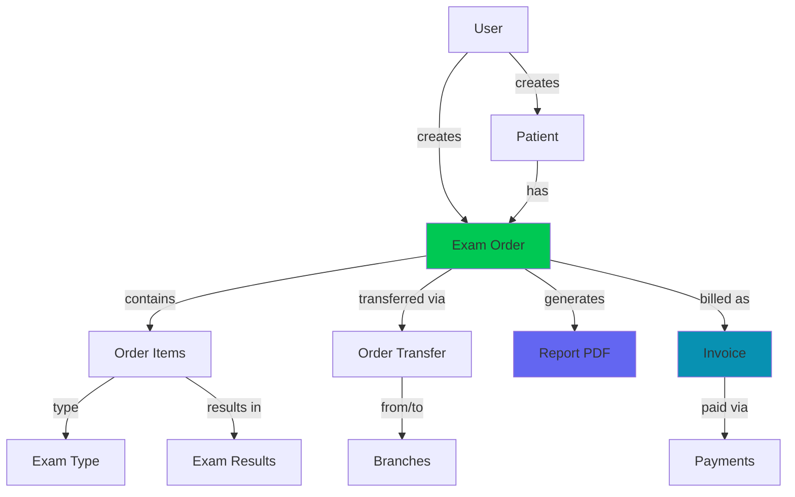
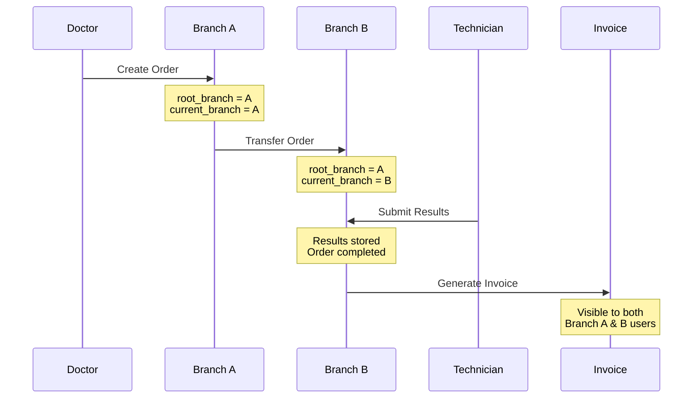
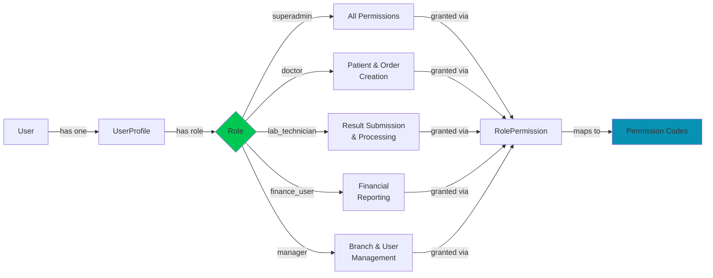
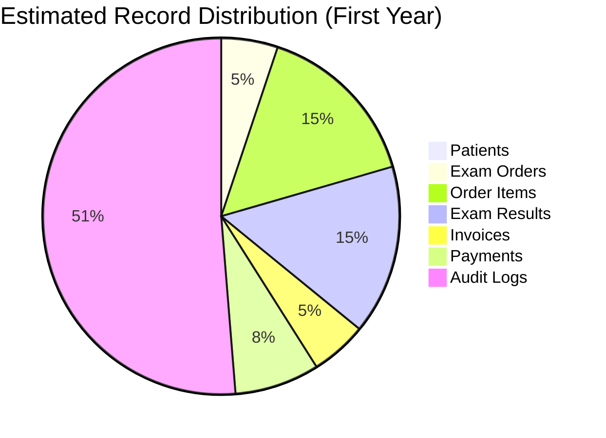
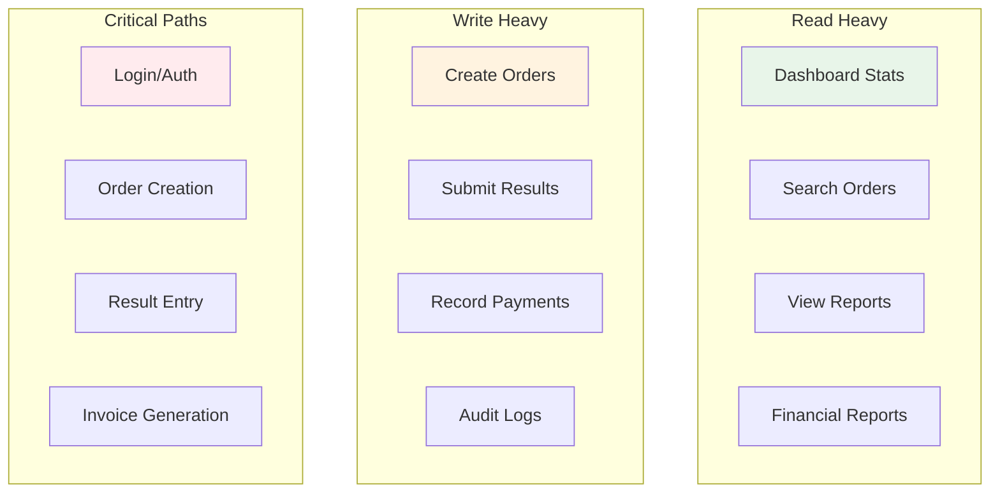
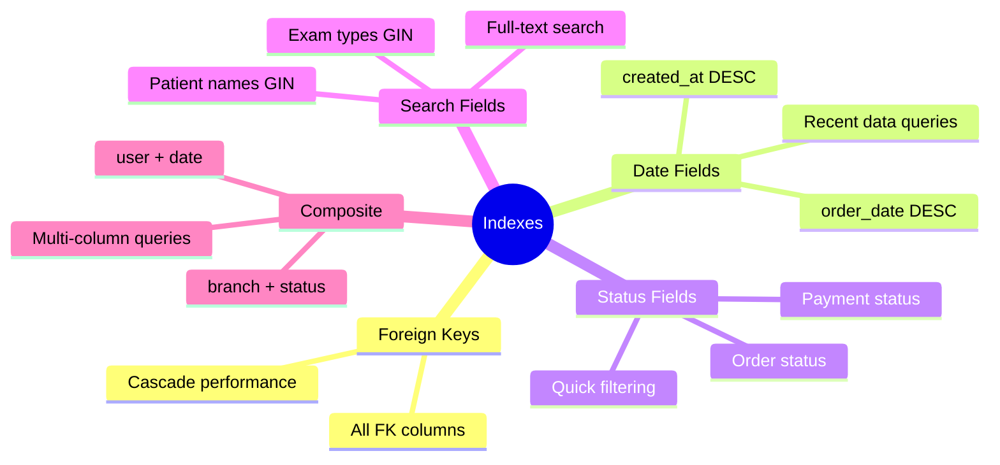
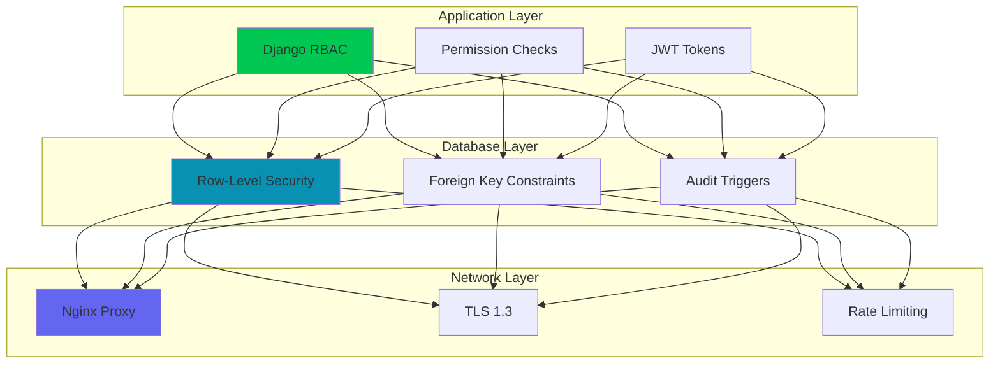

# Database Schema - Visual Diagrams

## Complete ERD (Mermaid Format)

```mermaid
erDiagram
    %% Authentication & Users
    users ||--|| user_profiles : has
    users ||--o{ audit_logs : generates
    user_profiles }o--|| branches : "assigned to"
    user_profiles }o--o{ permissions : "has through role_permissions"
    
    %% Branches
    branches ||--o{ patients : contains
    branches ||--o{ exam_orders : "root branch"
    branches ||--o{ exam_orders : "current branch"
    branches ||--o{ invoices : "belongs to"
    
    %% Patients
    patients ||--o{ patient_records : has
    patients ||--o{ exam_orders : "orders for"
    patients ||--o{ invoices : "billed to"
    users ||--o{ patients : creates
    
    %% Orders & Exams
    exam_orders ||--o{ order_items : contains
    exam_orders ||--o{ order_transfers : "transferred via"
    exam_orders ||--|| invoices : "billed as"
    exam_orders ||--|| reports : "generates"
    
    order_items }o--|| exam_types : "type of"
    order_items ||--|| exam_results : "results in"
    
    %% Billing
    invoices ||--o{ payments : "paid via"
    
    %% System
    users ||--o{ notifications : receives

    %% Table Definitions
    users {
        bigint id PK
        varchar email UK "Primary login"
        varchar username UK
        varchar password "Argon2 hashed"
        boolean is_active
        int failed_login_attempts
        timestamp locked_until
        inet last_login_ip
        timestamp created_at
    }
    
    user_profiles {
        bigint id PK
        bigint user_id FK,UK
        varchar role "5 roles"
        bigint branch_id FK,NULL
        varchar phone
        varchar avatar
    }
    
    permissions {
        bigint id PK
        varchar code UK "module.action"
        varchar name
        varchar module
    }
    
    role_permissions {
        bigint id PK
        varchar role
        bigint permission_id FK
    }
    
    audit_logs {
        bigint id PK
        bigint user_id FK,NULL
        varchar action
        inet ip_address
        text user_agent
        jsonb details
        timestamp created_at
    }
    
    branches {
        bigint id PK
        varchar name
        varchar code UK
        text address
        varchar phone
        varchar email
        boolean is_active
    }
    
    patients {
        bigint id PK
        varchar first_name
        varchar last_name
        date date_of_birth
        varchar gender
        varchar identification_number UK
        varchar phone
        bigint branch_id FK
        bigint created_by_id FK
    }
    
    patient_records {
        bigint id PK
        bigint patient_id FK
        date record_date
        text chief_complaint
        text diagnosis
        bigint created_by_id FK
    }
    
    exam_types {
        bigint id PK
        varchar code UK
        varchar name
        varchar category
        decimal price
        varchar sample_type
        boolean is_active
    }
    
    exam_orders {
        bigint id PK
        varchar order_number UK
        bigint patient_id FK
        bigint root_branch_id FK "Immutable"
        bigint current_branch_id FK "Mutable"
        varchar status
        decimal total_price
        bigint created_by_id FK
        timestamp order_date
    }
    
    order_items {
        bigint id PK
        bigint order_id FK
        bigint exam_type_id FK
        decimal price
        varchar status
    }
    
    order_transfers {
        bigint id PK
        bigint order_id FK
        bigint from_branch_id FK
        bigint to_branch_id FK
        bigint transferred_by_id FK
        timestamp transferred_at
    }
    
    exam_results {
        bigint id PK
        bigint order_item_id FK,UK
        varchar result_value
        boolean is_abnormal
        jsonb detailed_results
        bigint performed_by_id FK
        timestamp performed_at
    }
    
    reports {
        bigint id PK
        bigint order_id FK,UK
        varchar report_number UK
        varchar pdf_file_path
        boolean is_finalized
        bigint generated_by_id FK
    }
    
    invoices {
        bigint id PK
        varchar invoice_number UK
        bigint order_id FK,UK
        bigint patient_id FK
        bigint branch_id FK
        decimal total_amount
        decimal amount_paid
        decimal amount_due "Auto-calculated"
        varchar payment_status
        date invoice_date
    }
    
    payments {
        bigint id PK
        bigint invoice_id FK
        varchar payment_number UK
        decimal amount
        varchar payment_method
        date payment_date
        bigint recorded_by_id FK
    }
    
    notifications {
        bigint id PK
        bigint user_id FK
        varchar title
        text message
        varchar notification_type
        boolean is_read
        timestamp created_at
    }
```

## Simplified Core Flow Diagram



## Multi-Branch Order Flow



## RBAC Permission Flow



## Table Size Estimates



## Data Access Patterns



## Key Indexes Strategy



## Security Layers



---

## How to View These Diagrams

### In VS Code
1. Install "Markdown Preview Mermaid Support" extension
2. Open this file
3. Click "Preview" button

### In GitHub
- Mermaid diagrams render automatically in GitHub Markdown

### Online
- Copy diagram code to: https://mermaid.live

---

## Schema Statistics

| Metric | Count |
|--------|-------|
| Total Tables | 23 |
| Total Indexes | 60+ |
| Foreign Keys | 35+ |
| Triggers | 11 |
| Views | 2 |
| Functions | 2 |

---

## Critical Relationships

### 🔴 Critical (Cannot Delete)
- User → UserProfile (one-to-one)
- Order → OrderItems (one-to-many)
- Order → Invoice (one-to-one)

### 🟡 Important (Soft Delete Recommended)
- Patient → Orders
- Branch → Users
- ExamType → OrderItems

### 🟢 Safe to Delete
- Notifications
- Audit Logs (after retention period)
- Order Transfers (historical data)
